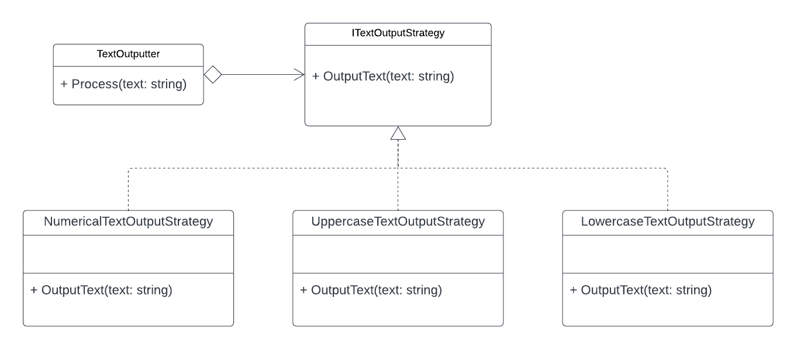

# The Strategy Pattern
The Strategy pattern enables a specific behaviour in a group of algorithms to be selected by the client that is using the strategy.

## Example
In this example a TextOutputter class is passed different strategies at run-time to output the same text in different ways.

## UML
